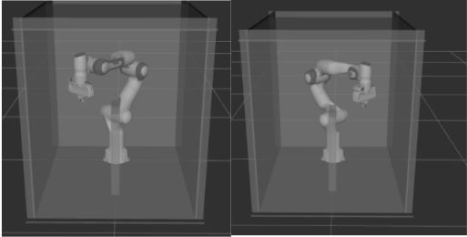
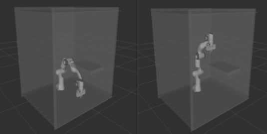
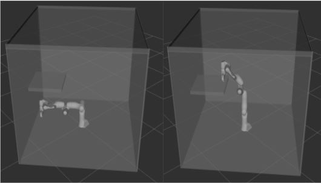

# Sampling-based Planning for Robot Arm

This is the final project of the CMU-16782. It has the implementation of basic forward/inverse kinematics, and the sampling_based path planning with constraints for the Franka Robot Arm.

For Ubuntu 16.04:

1. Install ROS Kinetic on your computer following instructions here: [http://wiki.ros.org/ kinetic/Installation/Ubuntu.](http://wiki.ros.org/ kinetic/Installation/Ubuntu. ) (Make sure to install the Desktop-Full Install version of ROS Kinetic.)

2. Install libfranka and franka_ros using the following command:

   `sudo apt install ros-kinetic-libfranka ros-kinetic-franka-ros`

3. Install all requirements.

   `pip install -r requirements.txt`

4. Change the path argument in visualize.launch to the path to your working folder.

5. Run the RRT planner:

   `python3 plan.py --rrt` or `python3 plan.py --rrt --map2` for using the second map， or `python3 plan.py --rrt --map3` for using the third map.

   Run the CBIRRT planner:

   `python3 plan.py --rrtc` or `python3 plan.py --rrtc --map2` for using the second map, or `python3 plan.py --rrtc --map3` for using the third map.

   Run the PRM planner:

   `python3 plan.py --prm` or `python3 plan.py --prm --map2` for using the second map, or `python3 plan.py --prm --map3` for using the third map.

   If reusing the graph created before:

   `python3 plan.py --prm [--map2/map3]--reuse_graph`

   Run the OBPRM planner:

   `python3 plan.py --obprm` or `python3 plan.py --obprm --map2` for using the second map, or `python3 plan.py --obprm --map3` for using the third map.

   If reusing the graph created before:

   `python3 plan.py --obprm [--map2/map3]--reuse_graph`

### Environment

We designed three problems for the robot arm, in which it needs to move from a start position to agiven goal position while avoiding obstacles. 

*Scene 1*: 

*Scene 2*: 

*Scene 3*: 

### Video Demo

[Watch the video](https://youtu.be/d0d5chidEpo)

